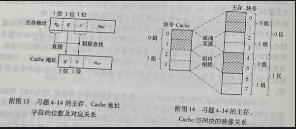

[TOC]
#### 4-1 设二级虚拟存储器的$T_{A_1} = 10^{-7}s$,$T_{A_2} = 10^{-2}s$
为使存储层次的访问效率e达到最大值的80%以上，命中率H至少要求达到多少？
实际上这样高的命中率是很难达到的，那么从存储层次上如何改进？

tpis:
公式: $T_A = HT_{A1} +(1-H)T_{A2}$
`可推导出`:$H = \frac{T_A - T_{A2}}{T_{A1} - T_{A2}}$
$H$ 主存命中率(`高速存储器命中率`)
$T_A$ 虚拟存储器平均访问时间(`组合平均访问时间`)
$T_{A1}$ 主存M1平均访问时间(`高速存储器平均访问时间`)
$T_{A2}$ 辅存M2平均访问时间(`低速存储器平均访问时间`)
`效率`$e = T_A/T_{A1}$ 越接近1越好
***
解答:
(1)
```
TA = HTA1+(1-H)TA2
e = TA1/TA = 10^-7 * 0.8
TA = TA1/0.8*10^-7

10^-7/0.8*10^-7 = H*10^-7+(1-H)*10^-2
1.25*10^-7 = H*10^-7+10^-2-H*10^-2
1.25*10^-7 = H(10^-7-10^-2)+10^-2
H = (1.25*10^-7-10^-2)/(10^-7-10^-2)
H = 0.99999975
```
(2)
实际上，这样高的命中率是极难达到的，为此需要减少相邻两级的访问速度差距，或者减少相邻两级存储器的容量差。
此外，可在主、辅存之问增设一级存储器，让其速度介于主存、辅存之间，让主存与中间级的访问时间比为`1：100`，中间级与辅存的访问时间比为`1：1000`，
将它们配上相应辅助软、硬件，组成一个三级存储层次，这样，可使第1级主存的命中率降低到 H = 0.997
```
TAc = 10^-7*100

TA = HTA1+(1-H)TAc
e = TA1/TA = 10^-7 * 0.8
TA = TA1/0.8*10^-7
10^-7/0.8*10^-7 = H*10^-7+(1-H)*10^-5
1.25*10^-7 = H*10^-7+10^-5-H*10^-5
1.25*10^-7 = H(10^-7-10^-5)+10^-5
H1 = (1.25*10^-7-10^-5)/(10^-7-10^-5) = 0.997 
```


#### 4-2 一个二级虚拟存储器,CPU访问主存$M_1$，和辅存$M_2$的平均时间分别为1us和1ms。
经实测，此虚拟存储器平均访问时间为100us。
试定性提出使虚拟存储器平均访问时间能降到10us的几种方法，并分析这些方法在硬件和软件上的代价。
***
tpis:可用4-1公式

求H:
100 = H*1+(1-H)*1000
100 = H+1000-1000H
100-1000=H-1000H
H(1-1000) = 100-1000
H = 100-1000/1-1000 = -900/-999 = 0.9009

***
解答:
根据实测到的虚拟存储器平均访问时间$T_A$ = 100us,代入 $T_A = HT_{A1} +(1-H)T_{A2}$ 可得主存命中率为:
$H = \frac{T_A-T_{A2}}{T_{A1}-T_{A2}} = \frac{100us-1ms}{1us-1ms} = 0.901$
在主存命中率H=0.901的情况下既使$T_A1 = 0$:
0.901 = Ta-1000/0-1000
Ta-1000 = 0.901*-1000
Ta = 0.901*-1000+1000 = 99us
还是远远满足不了所要求的10us,所以应以提高主存命中率着手。
如果要让TA = 10us,代入公式，主存命中率为:
H = 10-1000/1-1000 = 0.990990991=0.991
要使H提高到0.991,需要从改进`替换算法`、`调度策略`、调整`页面大小`以及提高`主存容量`等多方面综合采取措施。
其中，替换算法、调度策略主要是在`软件`上增加一些代价;页面大小的调整可能会增加`辅助硬件`上的代价；
而主存容量的增加主要是增加`硬件`的代价，在`辅助硬件`上的代价也会略有增大。
ps:`主存页面调度算法`。

#### 4-3 由4.1.3节所述二级存储层次的每位价格c和访问时间$T_A$的表达式，导出n级存储层次相应的表达式。
解答:
存储层次的每位平均价格为:
$c = \frac{\sum_{i=1}^nc_i*S_{mi}}{\sum_{i=1}^nS_{mi}}$
存储层次的访问时间为:
$T_A = \sum_{i=1}^n(H_i*T_{Ai})$
其中, $\sum_{1}^nH_i = 1$

#### 4-4 某虚拟存储器共8个页面，每页为 1024 个字，实际主存为 4096个字，采用页表法进行地址映像。映像表的内容如表4-3所示。(此题为2023.10题型)
| 实页号 | 装入位 |
|-----|-----|
| 3   | 1   |
| 1   | 1   |
| 2   | 0   |
| 3   | 0   |
| 2   | 1   |
| 1   | 0   |
| 0   | 1   |
| 0   | 0   |
(1)列出会发生页面失效的全部虚页号。
(2)按以下虚地址计算主存实地址:0,3728,1023,1024,2055,7800,4096,6800。

***
tips:
1. 标出虚页号，从0开始，依次递增。

| 虚页号 | 实页号 | 装入位 |
|-----|-----|-----|
| 0   | 3   | 1   |
| 1   | 1   | 1   |
| 2   | 2   | 0   |
| 3   | 3   | 0   |
| 4   | 2   | 1   |
| 5   | 1   | 0   |
| 6   | 0   | 1   |
| 7   | 0   | 0   |

以本体为例,表项应该有 虚地址  虚页号 虚页页内位移 装入位  实页号  实页页内位移  实地址  
虚地址:虚拟存储器地址
虚页号:虚拟存储器页号
页内位移:页内移动数
装入位:0为缺页，1为已装入
实页号:实际存储页号
实地址:内存(cache)实际地址

已知虚地址，求其他,
虚页号 = 虚地址/每页大小 取整
页内位移 = 虚地址 - (虚页号\*每页大小)
装入位 根据虚页号查表
实页号 根据虚页号查表
页内位移 和虚地址业内位移一样
实地址 = (实页号\*每页大小)+页内位移

***

解答:
(1)发生页面失效的全部虚页号就是页映像表中所有装人位为 “0”的行所对定的虚页号的集合。本题为2、3、5、7。
(2) 由虚地址计算主存实地址的情况如附表4所示

| 虚地址  | 虚页号 | 页内位移 | 装入位 | 实页号  | 页内位移 | 实地址  |
|------|-----|------|-----|------|------|------|
| 0    | 0   | 0    | 1   | 3    | 0    | 3072 |
| 3728 | 3   | 656  | 0   | 页面失效 | 页面失效 | 无    |
| 1023 | 0   | 1023 | 1   | 3    | 1023 | 4095 |
| 1024 | 1   | 0    | 1   | 1    | 0    | 1024 |
| 2055 | 2   | 7    | 0   | 页面失效 | 页面失效 | 无    |
| 7800 | 7   | 632  | 0   | 页面失效 | 页面失效 | 无    |
| 4096 | 4   | 0    | 1   | 2    | 0    | 2048 |
| 6800 | 6   | 656  | 1   | 0    | 656  | 656  |


#### 4-5 一个段页式虚拟存储器，虚地址有2位段号、2位页号、11位页内位移（按字编址），主存容量为32K字。每段可有访问方式保护，其页表和保护位如表4-4 所示。
| 段号      | 段0   | 段1    | 段2      | 段3   |
|---------|------|-------|---------|------|
| 访问方式    | 只读   | 可读/执行 | 可读/写/执行 | 可读/写 |
| 虚页0所在位置 | 实页9  | 在辅存上  | 页表不在主存内 | 实页14 |
| 虚页1所在位置 | 实页3  | 实页0   | 页表不在主存内 | 实页1  |
| 虚页2所在位置 | 在辅存上 | 实页15  | 页表不在主存内 | 实页6  |
| 虚页3所在位置 | 实页12 | 实页8   | 页表不在主存内 | 在辅存上 |

| 方式    | 段 | 页 | 页内位移 |
|-------|---|---|------|
| 取数    | 0 | 1 | 1    |
| 取数    | 1 | 1 | 10   |
| 取数    | 3 | 3 | 2048 |
| 存数    | 0 | 1 | 4    |
| 存数    | 2 | 1 | 2    |
| 存数    | 1 | 0 | 14   |
| 转移至此处 | 1 | 3 | 100  |
| 取数    | 0 | 2 | 50   |
| 取数    | 2 | 0 | 5    |
| 转移至此处 | 3 | 0 | 60   |

(1)此地址空间中共有多少个虚页？
(2)当程序中遇到如表4-5所示的各种情况时，写出由虚地扯计算出的实地址。说明哪个会发生段失效、页失效或保护失效。
***
tips:
(1) 2位段号和2位页号为二进制，可编码条数位$2^2 * 2^2 = 16$
(2) 实地址 = 实页号 x 页面大小 + 业内位移
页面大小 = 2^{页内位移位数} = 2^11 = 2048
***
解答:
(1)虚地址有2位段号、2位页号，故程序最多可有4×4=16个虚页。
(2)程序遇到表左部各情况时，是否会发生段失效、页失效、保护失效及相应的主存实地址的情况如附表5的右部所示。
表中，`实地址` = 实页号 x 页面大小 + 页内位移。

| 方式    | 段 | 页 | 页内位移 | 段失效 | 页失效 | 实页号 | 实地址   | 保护失效 |
|-------|---|---|------|-----|-----|-----|-------|------|
| 取数    | 0 | 1 | 1    | 无   | 无   | 3   | 6145  | 无    |
| 取数    | 1 | 1 | 10   | 无   | 无   | 0   | 10    | 无    |
| 取数    | 3 | 3 | 2048 | 无   | 有   | 无   | 无     | -    |
| 存数    | 0 | 1 | 4    | 无   | 无   | 3   | 6148  | 有    |
| 存数    | 2 | 1 | 2    | 有   | -   | 无   | 无     | -    |
| 存数    | 1 | 0 | 14   | 无   | 有   | 无   | 无     | -    |
| 转移至此处 | 1 | 3 | 100  | 无   | 无   | 8   | 16484 | 无    |
| 取数    | 0 | 2 | 50   | 无   | 有   | 无   | 无     | -    |
| 取数    | 2 | 0 | 5    | 有   | -   | 无   | 无     | -    |
| 转移至此处 | 3 | 0 | 60   | 无   | 无   | 14  | 28732 | 有    |
#### 4-6 设某程序包含5个虚页，其页地址流为4、5、3、2、5、1、3、2、2、5、1、3。
当使用LRU算法替换时，为获得最高的命中率，至少应分配给该程序几个实页？
其可能的最高命中率为多少？
***
模拟表:
A为页地址流
S堆栈内容
N实页数

| A  | 4 | 5 | 3 | 2 | 5 | 1 | 3 | 2 | 2 | 5 | 1 | 3 |
|----|---|---|---|---|---|---|---|---|---|---|---|---|
| S1 | 4 | 5 | 3 | 2 | 5 | 1 | 3 | 2 | 2 | 5 | 1 | 3 |
| S2 |   | 4 | 5 | 3 | 2 | 5 | 1 | 3 | 3 | 2 | 5 | 1 |
| S3 |   |   | 4 | 5 | 3 | 2 | 5 | 1 | 1 | 3 | 2 | 5 |
| S4 |   |   |   | 4 | 4 | 3 | 2 | 5 | 5 | 1 | 3 | 2 |
| S5 |   |   |   |   |   | 4 | 4 | 4 | 4 | 4 | 4 | 4 |
| S6 |   |   |   |   |   |   |   |   |   |   |   |   |
| N1 |   |   |   |   |   |   |   |   | H |   |   |   |
| N2 |   |   |   |   |   |   |   |   | H |   |   |   |
| N3 |   |   |   |   | H |   |   |   | H |   |   |   |
| N4 |   |   |   |   | H |   | H | H | H | H | H | H |
| N5 |   |   |   |   | H |   | H | H | H | H | H | H |

解答:
模拟结果表明，使用 LRU 替换算法进行替换，对该程序至少应分配4个实页。
如果只分配3个实页，其页命中率只有2/12，太低；而分配实页数多于4页后，其页命中率不会再有提高。
所以，分配给该程序4个实页即可，其可能的最高命中率为 H=7/12。

#### 4-7 有一个虚拟存储器，主存有0-3四页位置，程序有0-7八个虚页，采用全相联映像和FIFO替换算法。给出如下程序页地址流：2、3、5、2、4、0、1、2、4、6。
(1)假设程序的2、3、5 页已先后装人主存的第3、2、0 页位置，请画出上述页地址流工作过程中，主存各页位置上所装程序各页页号的变化过程图，并标出命中时刻。
(2)求出此期间虚存总的命中率H。
tips:
注意，是全相联，不是组相连。
解答:
(1)
L 主存页面位置
D 初始状态
H 命中

| L | D | 2 | 3 | 5 | 2 | 4  | 0  | 1  | 2  | 4  | 6  |
|---|---|---|---|---|---|----|----|----|----|----|----|
| 0 | 5 | 5 | 5 | 5 | 5 | 5  | 5  | 5* | 2  | 2  | 2  |
| 1 |   |   |   |   |   | 4  | 4  | 4  | 4* | 4* | 6  |
| 2 | 3 | 3 | 3 | 3 | 3 | 3  | 3* | 1  | 1  | 1  | 1  |
| 3 | 2 | 2 | 2 | 2 | 2 | 2* | 0  | 0  | 0  | 0  | 0* |
| H |   | H | H | H | H |    |    |    |    | H  |    |

(2) 5/10=50%
#### 4-8 采用LRU替换算法的页式虚拟存储器共有9页空间准备分配给A、B两道程序。
已知B道程序若给其分配4页时，命中率为 8/15；若分配5页时，命中率可达10/15。
现给出A道程序的页地址流为2、3、2、1、5、2、4、5、3、2、5、2、1、4、5。
(1)画出用堆栈对A道程序页地址流的模拟处理过程图，统计给其分配4页和5页时的命中率。
(2)根据己知条件和上述统计结果,给A、B两道程序各分配多少实页，可使系统效率最高？
解答:
(1)用堆栈对A道程序页地址流的模拟处理过程如附表8所示:
A为页地址流
S堆栈内容
N实页数

| A  | 2 | 3 | 2 | 1 | 5 | 2 | 4 | 5 | 3 | 2 | 5 | 2 | 1 | 4 | 5 |
|----|---|---|---|---|---|---|---|---|---|---|---|---|---|---|---|
| S1 | 2 | 3 | 2 | 1 | 5 | 2 | 4 | 5 | 3 | 2 | 5 | 2 | 1 | 4 | 5 |
| S2 |   | 2 | 3 | 2 | 1 | 5 | 2 | 4 | 5 | 3 | 2 | 5 | 2 | 1 | 4 |
| S3 |   |   |   | 3 | 2 | 1 | 5 | 2 | 4 | 5 | 3 | 3 | 5 | 2 | 1 |
| S4 |   |   |   |   | 3 | 3 | 1 | 1 | 2 | 4 | 4 | 4 | 3 | 5 | 2 |
| S5 |   |   |   |   |   |   | 3 | 3 | 1 | 1 | 1 | 1 | 4 | 3 | 3 |
| N4 |   |   | H |   |   | H |   | H |   | H | H | H |   |   | H |
| N5 |   |   | H |   |   | H |   | H | H | H | H | H | H | H | H |

由附表8计算可知，分配4页时，H=7/15；分配5页时，H=10/15。
(2)给A分配5页，给B分配4页，其系统效率要比给A分配4页，给B分配5页的高。
因为前者,总命中率为（10/15 +8/15）/2 =9/15
后者系统的,总命中率为(10/15+7/15)2=8.5/15。
#### 4-9 采用页式管理的虚拟存储器，分时运行两道程序。其中，程序X为:
```
   DO 50 I = 1,3
   B(I) = A(I) - C(I)
   IF(B(I).LE.0) GOTO 40
   D(I)= 2 * C(I) - A(I)
   IF(D(I).EQ.0) GOTO 50
40 E(I) = 0
50 CONTINUE
Data: A = (-4, +2, 0)
      C = (-3, 0, +1)
```
每个数组分別放在不同的页面中；而程序Y在运行过程中，其数组将依次用到程序空间的第3、5、4、2、5、3、1、3、2、5、1、3、1、5、2页。
如果采用LRU算法替换实行却只有8页位置可供数组用。试问为这两道程序的数组分别分配多少个实页最为合理？为什么？
***
tips:
程序x为Fortran语言，`DO`、`CONTINUE`为循环;`LE`为小于等于;`EQ`为等于;
Data为数组，值通过(下标+1?)获取值(1,2,3)。
`DO 50 I = 1,3`  循环1,2,3共计三次。

第一次循环:I=1
B(I)=A(I)-C(I)=-4+3=-1 [acb]
B(I)<0 GOTO 40 E(1)=0 [e]
第二次循环:I=2
B(I)=A(I)-C(I)=2+0=2 [acb]
D(I)= 2*C(I)-A(I)=2*0-2 = -2[cad]
E(I) = 0[e]
第三次循环:I=3
B(I)=A(I)-C(I)=0-1=-1 [acb]
B(I)<0 GOTO 40 E(1)=0 [e]
最终序列为 a c b e a c b c a d e a c b e
***
X=程序X页地址流
S堆栈内容
N实页数

| X  | a | c | b | e | a | c | b | c | a | d | e | a | c | b | e |
|----|---|---|---|---|---|---|---|---|---|---|---|---|---|---|---|
| S1 | a | c | b | e | a | c | b | c | a | d | e | a | c | b | e |
| S2 |   | a | c | b | e | a | c | b | c | a | d | e | a | c | b |
| S3 |   |   | a | c | b | e | a | a | b | c | a | d | e | a | c |
| S4 |   |   |   | a | c | b | e | e | e | b | c | c | d | e | a |
| S5 |   |   |   |   |   |   |   |   |   | e | b | b | b | d | d |
| N1 |   |   |   |   |   |   |   |   |   |   |   |   |   |   |   |
| N2 |   |   |   |   |   |   |   | H |   |   |   |   |   |   |   |
| N3 |   |   |   |   |   |   |   | H | H |   |   | H |   |   |   |
| N4 |   |   |   |   | H | H | H | H | H |   |   | H | H |   | H |
| N5 |   |   |   |   | H | H | H | H | H |   | H | H | H | H | H |
H3=3/15 H4=8/15 H5=10/15

| Y  | 3 | 5 | 4 | 2 | 5 | 3 | 1 | 3 | 2 | 5 | 1 | 3 | 1 | 5 | 2 |
|----|---|---|---|---|---|---|---|---|---|---|---|---|---|---|---|
| S1 | 3 | 5 | 4 | 2 | 5 | 3 | 1 | 3 | 2 | 5 | 1 | 3 | 1 | 5 | 2 |
| S2 |   | 3 | 5 | 4 | 2 | 5 | 3 | 1 | 3 | 2 | 5 | 1 | 3 | 1 | 5 |
| S3 |   |   | 3 | 5 | 4 | 2 | 5 | 5 | 1 | 3 | 2 | 5 | 5 | 3 | 1 |
| S4 |   |   |   | 3 | 3 | 4 | 2 | 2 | 5 | 1 | 3 | 2 | 2 | 2 | 3 |
| S5 |   |   |   |   |   |   | 4 | 4 | 4 | 4 | 4 | 4 | 4 | 4 | 4 |
| N1 |   |   |   |   |   |   |   |   |   |   |   |   |   |   |   |
| N2 |   |   |   |   |   |   |   | H |   |   |   |   | H |   |   |
| N3 |   |   |   |   | H |   |   | H |   |   |   |   | H | H |   |
| N4 |   |   |   |   | H | H |   | H | H | H | H | H | H | H | H |
| N5 |   |   |   |   | H | H |   | H | H | H | H | H | H | H | H |
H3=4/15 H4=10/15 H5=10/15

XY分别分配3,5个实页时，平均命中率为: 3/15+10/15 / 2 = 6.5/15
XY分别分配4,4个实页时，平均命中率为: 8/15 + 10/15 /2 = 9/15
XY分别分配5,3个实页时，平均命中率为: 10/15+4/15 /2 = 7/15
综上: 各自分配四个4个实页的平均命中率最高，最为合理。
#### 4-10 设一个按位编址的虚拟存储器，它应可对应1K个任务，
但在一段较长时间内，一般只有4个任务在使用，故用容量为4行的相联寄存器组硬件来缩短被交换的虚地址中的用户位位数;
每个任务的程序空间可达4096页，每页为512个字节，实主存容址为$2^{20}$位：设快表用按地址访问存储器构成，行数为32，快表的地址是经散列形成;
为减少散列冲突，配有两套独立的相等比较器电路。请设计该地址变换机构，内容包括：
(1)画出其虚、实地址经快表变换的逻辑结构示意图。
(2)相联寄存器组中每个寄存器的相联此较位数。
(3)相联奇存器组中每个奇存器的总位数。
(4)散列变换硬件的输入位数和输出位数。
(5)每个相等比较器的位数。
(6)快表的总容量(以位为单位）。
答:
> 1.png


#### 4-11 考虑一个920个字的程序，其访问虚存的地址流为 20、 22、208、 214、146、 618、370、490、492、868、916、728.
(1)若页面大小为200字，主存容量为400字，采用FIFO替换算法，请按访存的各个时刻，写出其虚页地址流，计算主存的命中率。
(2)若页面大小改为100宇，再做一遍。
(3)若页面大小改为400字，再做一遍。
(4)由(1)(2)(3)的结果可得出什么结论？
(5)若把主存容量增加到800字，按第(1)题再做一遍，又可以得到什么结论？

答:
(1) 页面大小200,容量400
A虚地址 P虚页地址流 N实页数 H?是否命中

| A  | 20 | 22 | 208 | 214 | 146 | 618 | 370 | 490 | 492 | 868 | 916 | 728 |
|----|----|----|-----|-----|-----|-----|-----|-----|-----|-----|-----|-----|
| P  | 0  | 0  | 1   | 1   | 0   | 3   | 1   | 2   | 2   | 4   | 4   | 3   |
| N1 | 0  | 0  | 0*  | 0*  | 0*  | 3   | 3   | 3*  | 3*  | 4   | 4   | 4*  |
| N2 |    |    | 1   | 1   | 1   | 1*  | 1*  | 2   | 2   | 2*  | 2*  | 3   |
| H? |    | H  |     | H   | H   |     | H   |     | H   |     | H   |     |
H = 6/12=50%

(2) 页面大小100,容量400
A虚地址 P虚页地址流 N实页数 H?是否命中

| A  | 20 | 22 | 208 | 214 | 146 | 618 | 370 | 490 | 492 | 868 | 916 | 728 |
|----|----|----|-----|-----|-----|-----|-----|-----|-----|-----|-----|-----|
| P  | 0  | 0  | 2   | 2   | 1   | 6   | 3   | 4   | 4   | 8   | 9   | 7   |
| N1 | 0  | 0  | 0   | 0   | 0   | 0*  | 3   | 3   | 3   | 3   | 3*  | 7   |
| N2 |    |    | 2   | 2   | 2   | 2   | 2*  | 4   | 4   | 4   | 4   | 4*  |
| N3 |    |    |     |     | 1   | 1   | 1   | 1*  | 1*  | 8   | 8   | 8   |
| N4 |    |    |     |     |     | 6   | 6   | 6   | 6   | 6*  | 9   | 9   |
| H? |    | H  |     | H   |     |     |     |     | H   |     |     |     |
H = 3/12 = 25%

(3) 页面大小400,容量400
A虚地址 P虚页地址流 N实页数 H?是否命中

| A  | 20 | 22 | 208 | 214 | 146 | 618 | 370 | 490 | 492 | 868 | 916 | 728 |
|----|----|----|-----|-----|-----|-----|-----|-----|-----|-----|-----|-----|
| P  | 0  | 0  | 0   | 0   | 0   | 1   | 0   | 1   | 1   | 2   | 2   | 1   |
| N1 | 0  | 0  | 0   | 0   | 0   | 1   | 0   | 1   | 1   | 2   | 2   | 1   |
| H? |    | H  | H   | H   | H   |     |     |     | H   |     | H   |     |
H = 6/12=50%

(4)由(1)(2)(3)的结果可以看出，在分配给程序的实存容量一定(400 字)的条件下,页面大小过小时，命中率较低;
页面大小增大后，两个地址在同页内的机会增大，使命中率有所上升;
由于指令之问因远距离的跳转引起命中率下降的因素不起主要作用,还未出现随页面大小增大而使命中率下降的情识。
如果页地址流有大量的远距离转移,随页面大小的增大，因在主存中的页面数过少，导致出现虚存页面破轮流替换出去的“颠簸”现象，命中率反而会下降。

(5) 页面大小200,容量800
A虚地址 P虚页地址流 N实页数 H?是否命中

| A  | 20 | 22 | 208 | 214 | 146 | 618 | 370 | 490 | 492 | 868 | 916 | 728 |
|----|----|----|-----|-----|-----|-----|-----|-----|-----|-----|-----|-----|
| P  | 0  | 0  | 1   | 1   | 0   | 3   | 1   | 2   | 2   | 4   | 4   | 3   |
| N1 | 0  | 0  | 0   | 0   | 0   | 0   | 0   | 0*  | 0*  | 4   | 4   | 4   |
| N2 |    |    | 1   | 1   | 1   | 1   | 1   | 1   | 1   | 1*  | 1*  | 1*  |
| N3 |    |    |     |     |     | 3   | 3   | 3   | 3   | 3   | 3   | 3   |
| N4 |    |    |     |     |     |     |     | 2   | 2   | 2   | 2   | 2   |
| H? |    | H  |     | H   | H   |     | H   |     | H   |     | H   | H   |
H = 7/12=58.33%
可以看出，分配给程序的实存容量增大后，命中率将会有所上升。
不过,命中率的提高已不显著了，如果再增大容量,可以推断出命中率的上升就会渐趋平缓。
#### 4-12 在一个页式二级虚拟存储器中，采用FIFO算法进行页面替换，发现命中率H太低，因此有下列建议：
(1)增大辅存容量。
(2)增大主存容量（页数）。
(3)增大主、辅存的页面大小。
(4)FIFO 改为LRU
(5)FIFO改为LRU，并增大主存容量（页数)。
(6)FIFO 改为 LRU，且增大页面大小。
试分析上述各建议对命中率的影响情况。

解答:
(1)增大辅存容量，对主存命中率不会有什么影响。因为辅存容量增大，并不是程序空间的增大，程序空间与实主存空间的容量差并末改变。
所以，增大物理辅存容量，不会对主存的命中率有什么影响。

(2)如果主存容量(页数)增加较多，将使主存命中率有明显提高的趋势。
但如果主存容量增加较少，命中率H可能会略有增大，也可能不变，甚至还可能会有少许下降。这是因为其前提是命中率H太低。
如果主存容量显著增加，要访问的程序页面在主存中的机会会大大增加，命中率会显著上升。
但如果主存容量(页数）增加较少，加上使用的FIFO替换算法不是堆栈型的替换算法，那么命中率的提高可能不明显，甚至还可能有所下降。

(3)因为前提是主存的命中率H很低，所以在增大主、辅存的页面大小时，如果增加量较小，主存命中率可能没有太大的改变。
FIFO 是非堆栈型的替换算法，主存命中率可能会有所增加，也可能降低或不变。而当页面大小增加量较大时，可能会出现两种相反的情况。
当原页面较小时，在显著增大了页面大小之后，一般会使主存命中率有较大的提高。
当原页面较大时，再显著增大页面大小后,由于在主存中的页面数过少，将会使主存命中率有所下降。

(4)页面替换算法由 FIFO 改为 LRU 后，一般会使主存的命中率提高,因为 LRU 替换算法比 FIFO 替换算法能更好地体现出程序工作的局部性特点。
然而,主存命中率还与页地址流、分配给主存的实页数多少等有关，所以，主存命中率也可能仍然较低，没有明显改进。

(5)页面替换算法由 FIFO 改为 LRU，同时增大主存的容量(页数），一般会使主存命中 率有较大的提高，
因为 LRU 替换算法比 FIFO 替换算法更能体现出程序的局部性，又由于原先主存的命中率太低，现增大主存容量(页数），一般会使主存命中率上升。
如果主存容量增加量大些,主存命中率H将会显著上升。

(6)）页面替换算法由 FIFO 改为 LRU，且增大页面大小时，可能有两种结果：
如果原先页面大小很小，则会使命中率显著上升;
如果原先页面大小已经很大了，随着主存页数的进一步减少，命中率会有所下降。

#### 4-13 采用组相联映像的 Cache 存储器，Cache 为 1KB，要求 Cache 的每一块在一个主存周期内能从主存取得。
主存模4 交叉，每个分体宽为32位，总容量为 256KB。用按地址访问存储器构成相联目录表实现主存地址到 Cache 地址的变换，
并约定用4 个外相等比较电路。请设计此相联目录表，求出该表的行数、总位数及每个比较电路的位数。
?
解答:
> 2.png


#### 4-14 有一个Cache 存储器，主存共分8个块（0-7），Cache 为4个块(0-3），采用组相联映像，组内块数为2块，替换算法为近期最久未用过算法 (LRU)。
(1)画出主存、Cache 地址的各字段对应关系（标出位数）图。
(2)画出主存、Cache 空间块的映像对应关系示意图。
(3)对于如下主存块地址流：1、2、4、1、3、7、0、1、2、5、4、6、4、7、2，如果主存中的內容一开始未裝入Cache中，讲列出Cache中各块随时间的使用状况。
(4)对于（3)，指出块失效又发生块争用的时刻。
(5)对于（3），求出此期间 Cache 的命中率。

解答:
>3.png

>4.png


(1)主存、Cache 地址中各个字段的含义、位数及其映像的对应关系如附图13所示。
(2)主存、Cache 空间块的映像对应关系如附图 14 所示。
主存的第0、1、4、5 块只可映像装人或替换物理 Cache 中的第0、1块的内容。
主存的第2、3、6、7 块只可映像装人或替换物理 Cache 中的第2、3块的内容。
(3)程序运行时，由给出的主存块地址流可得到 Cache 中各个块的使用状况，如附表12所示。表中标“*”的是候选替换块的块号。
(4)发生 Cache 块失效又发生块争用的时刻有6、7、9、10、11、12、14、15。
(5)Cache的块命中率为 $H_e = \frac{3}{15} = 0.2$
#### 4-15 有一个 Cache 存储器，主存有0~7共8块，Cache 有4 块，采用组相联映像分2组。
假设 Cache 已先后访问并预取进了主存的第5、1、3、7块，现访存块地址流又为:1、2、4、1、3、7、0、1、2、5、4、6时：
(1)画出用LRU替换算法时,Cache內各块的实际替换过程图，并标出命中时刻。
(2)求出在此期间的 Cache 命中率。
解答:
> 5.png


#### 4-16 有一个 Cache 存储器，主存有0~7共8块，Cache 为4块，采用组相联映像,
设 Cache 已先后预取进了主存的第1、5、3、7块，现访存块地址流1、2、4、1、3、7、0、1、2、5、4、6时在Cache分2组的条件下：
(1)画出用 FIFO 替换算法时，Cache 内各块的实际替换过程图，并标出命中时刻。
(2)求出在此期间的 Cache 命中率。
解答:
> 6.png


#### 4-17 采用组相联映像、LRU替换算法的Cache存储器，发现等效访问速度不高，为此提议:
(1)增大主存容量。
(2)增大 Cache 中的块数（块的大小不变)。
(3)增大组相联组的大小（块的大小不变)
(4)增大块的大小 （组的大小和 Cache 总容量不变)。
(5)提高 Cache 本身器件的访问速度。
试问分别采用上述措施后，对等效访问速度可能会有什么样的显著变化？
其变化趋势如何？
如果采取措施后并未能使等效访问速度有明显提高的话，又是什么原因？
解答:
(1)增大主存容量，对$H_c$基本不影响。虽然增大主存容量可能会使$t_m$稍微有所加大，但如果$H_c$已很高，那么这种$t_m$的增大对$t_a$的增大不会有明显的影响。

(2)增大 Cache 中的块数，而块的大小不变，这意味着增大 Cache 的容量。
由于LRU替换算法是堆栈型的替换算法，因此将使$H_c$上升，从而使$t_a$缩短。$t_a$的缩短是否明显还要看当前$H_e$处在什么水平上。
如果原有 Cache 的块数较少，$H_e$较低，则$t_a$会因$H_e$迅速提高而显著缩短，如果原 Cache 的块数已较多，$H_e$已很高了，
则增大cache中的块数,不会使$H_e$再有明显提高，此时其$t_a$的缩短也就不明显了。

(3)增大组相联组的大小，块的大小不变，从而使组内的块数有了增加，它会使块冲突概率下降，这也会使 cache 块替换次数减少。
而当 cache 各组组内的位置已全部裝满了主存块之后，块替换次数的减少也就意味着$H_e$的提高。
所以，增大组的大小能使$H_e$提高从而可提高等效访问速度。
不过，Cache 存储器的等效访问速度改进是否明显还要看目前的$H_e$处于什么水平。
如果原先组内的块数太少，则增大组的大小会明显缩短$t_a$如果原先组内块数已较多，则$t_a$的缩短就不明显了。

(4)组的大小和Cache总容量不变，增大Cache块的大小，其对$t_a$影响的分析大致与（3）相同，会使$t_a$缩短，但要视目前的$H_c$水平而定。
如果$H_e$已经很高了，则增大Cache块的大小对$t_a$的改进也就不明显了。

(5)提高Cache 本身器件的访问速度，即减小$t_c$只有当$H_c$命中率已很高时，才会显著缩短$t_a$。
如果$H_e$命中率较低，对减小$t_a$的作用就不明显了。
#### 4-18 用组相联映像的 Cache 存储器，块的大小为$2^8$个单元，主存容量是 Cache 容量的4倍。
映像表用单体多字按地址方问存储器构成，己装人内容如表4-6所示。用4 套外比较电路实现组内相联查找块号。各字段用四进制编码表示。
(1)给出四进制编码表示的主存地址 3122203，问主存该单元的内容能否在 Cache中我到？ 若能找到，指出相应的 Cache 地址，也用四进制编码表示。
(2)给出四进制编码表示的主存地址 1210000 区2310333 呢？

| 组号q | $n_d$ | s' | s | $n_d$ | s' | s | $n_d$ | s' | s | $n_d$ | s' | s |
|-----|-------|----|---|-------|----|---|-------|----|---|-------|----|---|
| 0   | 0     | 0  | 1 | 2     | 0  | 0 | 2     | 2  | 2 | 3     | 2  | 3 |
| 1   | 0     | 1  | 3 | 0     | 3  | 2 | 3     | 3  | 1 | 0     | 0  | 0 |
| 2   | 3     | 3  | 0 | 3     | 2  | 1 | 3     | 1  | 2 | 1     | 1  | 3 |
| 3   | 0     | 2  | 2 | 3     | 1  | 3 | 2     | 1  | 1 | 2     | 0  | 0 |

解答:
(1) 由主存地址

| $n_d$ | q | s' | $n_{mr}$ |
|-------|---|----|----------|
| 3     | 1 | 2  | 2 2 0 3  |
中的q=1，到映像表（表4-6） 中的第1行里去查各个$n_d$、s'，在表中均未找到有$n_d$=3，s’=2的内容，
所以主存该块不在 Cache 中，发生Cache 块失效，无物理 Cache 地址。
(2)由主存地址

| $n_d$ | q | s' | $n_{mr}$ |
|-------|---|----|----------|
| 1     | 2 | 1  | 0 0 0 0  |
中的9=2，在映像表（表4-5） 中的第2行最右面找到有

| $n_d$ | s' | s |
|-------|----|---|
| 1     | 1  | 3 |
所以，该主存字在Cache中有，其Cache中物理单元的地址为

| q | s' | $n_{cr}$ |
|---|----|----------|
| 2 | 3  | 0 0 0 0  |
由主存地址

| $n_d$ | q | s' | $n_{mr}$ |
|-------|---|----|----------|
| 2     | 3 | 1  | 0 3 3 3  |
中的q=3，在映像表（表4-6）中的第3行的第3部分找到有

| $n_d$ | s' | s |
|-------|----|---|
| 2     | 1  | 1 |
所以，该主存字在Cache 中有，其Cache中物理单元的地址为

| q | s' | $n_{cr}$ |
|---|----|----------|
| 3 | 1  | 0 3 3 3  |
#### 4-19 假设你对Cache存储器的速度不满，于是申请到一批有限的经费，为能发挥其最大大经济效益，
有人建议你再买一些同样速度的Cache芯片，以扩充充其容量；
而另有人建议你干脆去买更高速的Cache芯片，将现有低速的 Cache 芯片全部换掉。
你认为哪种建议可取？如何做决定？为什么？
tips:
1. 计算TA 和TA1比较，差距不大，提高TA1速度，整体替换。
2. 差距大，将访Cache工作方式调整为流水。
3. 差距还是大，则提高命中率
4. 不增加硬件提高命中率 增大块大小，增加组内块数量。
5. 增加物理Cache数量提高命中率。

解答:
两种建议都存在盲日性。在做决定之前，应先实测一个程序运行过程中$t_a$的值，将它与第一级物理 Cache 的$t_c$比较。
如果两者已非常接近了，表示 $H_c$已趋于1，这时只有全部更换 Cache 芯片，使$t_c$下降来解决。
如果$t_a >> t_c$则先看Cache存储器内部是否已将查映像表和访Cache安排成流水方式工作。
如果未采取流水,则可改变成流水。在改变成流水方式后，如$t_a$仍大于$t_c$，且有一定差距，则表明$H_c$过低。
此时，应设法提高$H_c$。可先调整块的大小和组内的块数，让它们在Cache容量不增大的情况下，适当取大些，以提高$H_c$。
在此基础上，若还不能达到要求，就应购买一些同样速度的Cache芯片，对其物理Cache的容量进行扩充。这样，将会使$H_c$提高，而显著缩短$t_a$。